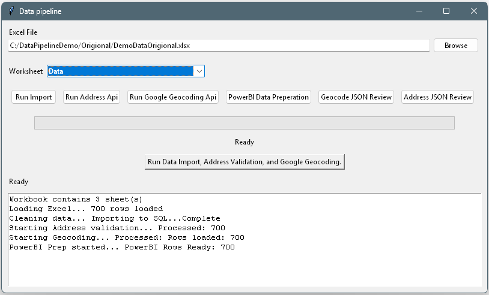
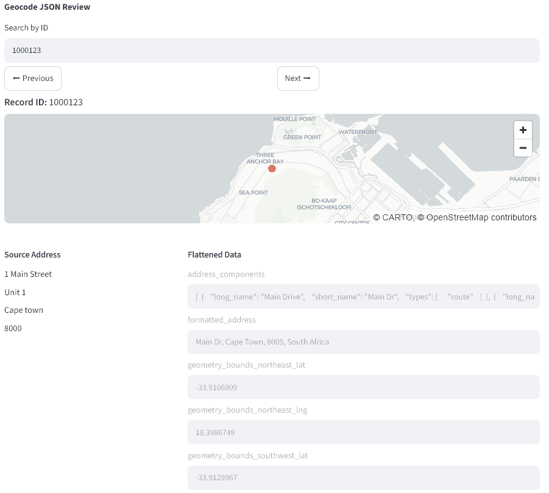
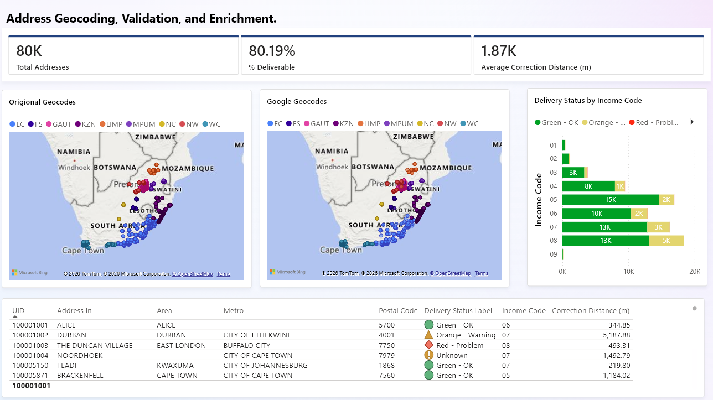

#  ELT (Extract, Load, Transform) DATA PIPELINE
## Overview
A Python-based ELT (Extract, Load, Transform) data pipeline for importing Excel datasets into SQL Server, 
enriching the data using third-party APIs, and producing reporting datasets for Power BI and Streamlit dashboards.
The application provides an end-to-end workflow from raw data ingestion through validation, geocoding, transformation, and reporting.


---

## FEATURES

-	Generate database tables, indexes, and stored procedures on startup
-	Import Excel (.xlsx) worksheets into SQL Server 
-	ELT architecture (Load raw data before transformation) 
-	Automated data enrichment 
-	Third-party address validation integration 
-	Google Geocoding API integration 
-	JSON response parsing and flattening 
-	Power BI reporting dataset generation 
-	Streamlit dashboards for data review 
-	Desktop interface built with Tkinter 


---

## Technology Stack

| Component | Technology |
| :--- | :--- |
| Language | Python |
| IDE | VS Code |
| Database | SQL Server |
| Database Access | pyodbc / SQLAlchemy |
| GUI | Tkinter |
| Dashboard | Streamlit |
| Reporting | Power BI |
| Data Processing | Pandas DataFrames |
| APIs | Address Validation API, Google Geocoding API |

---

## Architecture

  ```text
               Excel Workbook
                     │
                     ▼
          Select Worksheet (Tkinter)
                     │
                     ▼
          Load Raw Data into SQL Server
                     │
                     ▼
             Data Enrichment
        ┌──────────────────────────┐
        │ Address Validation API   │
        │ Google Geocoding API     │
        └──────────────────────────┘
                     │
                     ▼
        JSON Parsing / Flattening
                     │
                     ▼
             Stored Procedures
                     │
                     ▼
        Update SQL Server Tables
                     │
                     ▼
      Reporting & Analytics Layer
        ├── Power BI
        └── Streamlit Dashboards
```

---

## Pipeline Workflow
1. Extract
-	Select Excel workbook 
-	Select worksheet 
-	Read data into Pandas DataFrame
2. Load
-	Load raw data directly into SQL Server 
-	Preserve original source data 
-	Generate enrichment tables
3. Transform
-	Clean and standardize records 
-	Validate addresses using external API 
-	Geocode addresses using Google Maps API 
-	Flatten JSON responses into relational tables 
-	Merge enriched data into SQL Server
4. Reporting
-	Generate reporting tables (Stored procedure) 
-	Build Power BI dashboards 
-	Streamlit dashboards for review: 
    -	Address Flattened JSON Review 
    -	Geocoding Flattened JSON Review 


## Screenshots

### Tkinter Import Window


### Streamlit JSON Review Dashboard 

 
### Power BI Dashboard 


### Link
[Project Structure](docs/ProjectStructure.md)

## License

MIT License
